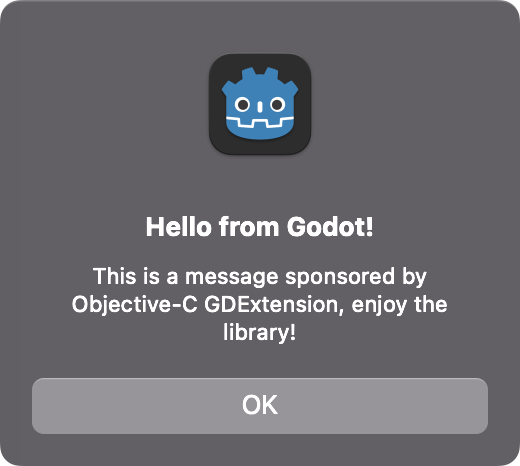
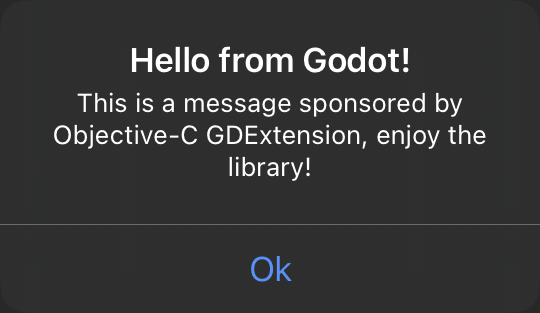

# Objective-C GDExtension
[](https://github.com/gilzoide/objectivec-gdextension/actions/workflows/build.yml)

Experimental GDExtension for calling Object-C methods at runtime in Godot 4.1+

**Warning**: misusage may crash the Godot editor and built projects.
Use at your own risk.


## Features
- All calls are made using the Objective-C runtime, so that all classes and methods are available
- Supports macOS, iOS and iOS Simulator builds, as well as the Godot editor running on macOS
- Uses [Key-Value Coding](https://developer.apple.com/documentation/objectivec/nsobject/nskeyvaluecoding) for getting and setting properties.
  Just use the same property names as in Objective-C and you're good to go.
- Automatic reference counting of Objective-C objects, since they are wrapped in `RefCounted` subclasses
- Automatic conversion from Godot data to Objective-C:
  + `String`, `StringName`, `NodePath` -> `NSMutableString`
  + `Array` -> `NSMutableArray`
  + `Dictionary` -> `NSMutableDictionary`
  + `PackedByteArray` -> `NSMutableData`
- Automatic conversion from Objective-C data to Godot:
  + `NSString` -> `String`
  + `NSNumber` -> `bool`, `int` or `float`
- `to_array` method for converting Objective-C objects that support enumeration, like `NSArray` and `NSSet`, to Godot `Array`
- `to_dictionary` method for converting Objective-C objects that support enumeration and the `objectForKey:` message, like `NSDictionary`, to Godot `Dictionary`
- Other useful methods, like `is_kind_of_class`, `responds_to_selector` and `conforms_to_protocol`
- Supports creating blocks from a `Callable` and the corresponding Objective-C method signature


## Caveats
- Currently only supports macOS and iOS.
  In multiplatform projects, you must check if you are in a supported platform before trying to use the API.
- This plugin makes its best to check for type compatibility between Godot and Objective-C and catch exceptions when sending messages, but it is possible for crashes to happen if the library is misused.
- Block invocation uses fixed integer arguments, so blocks with different call ABI, for example blocks called with float or double values, may crash.
- For now, there is no support for structs and pointers as arguments or return values.


## How to install
1. Go to the [Actions](https://github.com/gilzoide/objc-gdextension/actions) tab
2. Open the last successful build, or another successful one that targets the branch/commit you want to use
3. Download the "objc-gdextension" artifact
4. Extract it into your project
5. Open the Godot editor at least once after installing the extension
6. Enjoy 🍾


## How to use
```gdscript
extends Node

const ALERT_TITLE = "Hello from Godot!"
const ALERT_BODY = "This is a message sponsored by Objective-C GDExtension, enjoy the library!"


func _ready():
    # 1. Check for availability
    if not Engine.has_singleton("ObjectiveC"):
        print("Sorry, ObjectiveC is available on macOS and iOS only")

    # 2. Get the ObjectiveC singleton
    var ObjectiveC = Engine.get_singleton("ObjectiveC")

    match OS.get_name():
        # Let's show a macOS native alert
        "macOS":
            # 3.1. Get the Objective-C classes by name
            var NSAlert = ObjectiveC.NSAlert
            var NSApplication = ObjectiveC.NSApplication

            # 3.2. Alloc and init objects
            var alert = NSAlert.alloc("init")

            # 3.3. Get and set values normally
            # Note that property names must match the ones in Objective-C.
            # Note also that class properties work just as well.
            alert.messageText = ALERT_TITLE
            alert.informativeText = ALERT_BODY
            var window = NSApplication.sharedApplication.keyWindow

            # 3.4. Create blocks from Callable values
            # Note that you need to specify the Objective-C method signature,
            # since Callables don't have static typing, but blocks to.
            var alert_completion = func(): print("Alert dismissed!")
            var alert_completion_block = ObjectiveC.create_block("v", alert_completion)

            # 3.5. Send messages
            alert.perform_selector("beginSheetModalForWindow:completionHandler:", window, alert_completion_block)

        # Ok, let's try again with iOS alerts
        "iOS":
            # 3.1. Get the Objective-C classes by name
            var UIAlertController = ObjectiveC.UIAlertController
            var UIAlertAction = ObjectiveC.UIAlertAction
            var UIApplication = ObjectiveC.UIApplication

            # 3.2. Create blocks from Callable values
            var alert_completion = func(): print("Alert dismissed!")
            var alert_completion_block = ObjectiveC.create_block("v", alert_completion)

            # 3.3. Alloc and init objects
            # Some classes provide factory methods to construct objects.
            # Note that Objective-C classes are also regular Objective-C
            # objects, so you can message them as well.
            var alert = UIAlertController.perform_selector("alertControllerWithTitle:message:preferredStyle:", ALERT_TITLE, ALERT_BODY, 1)
            var ok_action = UIAlertAction.perform_selector("actionWithTitle:style:handler:", "Ok", 0, alert_completion_block)

            # 3.4. Get and set values normally
            var view_controller = UIApplication.sharedApplication.delegate.window.rootViewController

            # 3.5. Send messages
            alert.perform_selector("addAction:", ok_action)
            view_controller.perform_selector("presentViewController:animated:completion:", alert, true, null)
```


